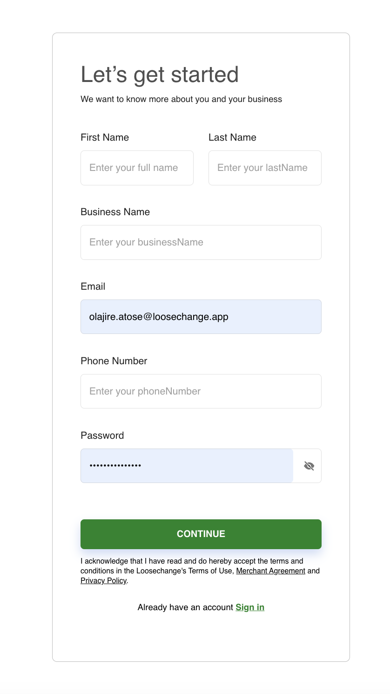
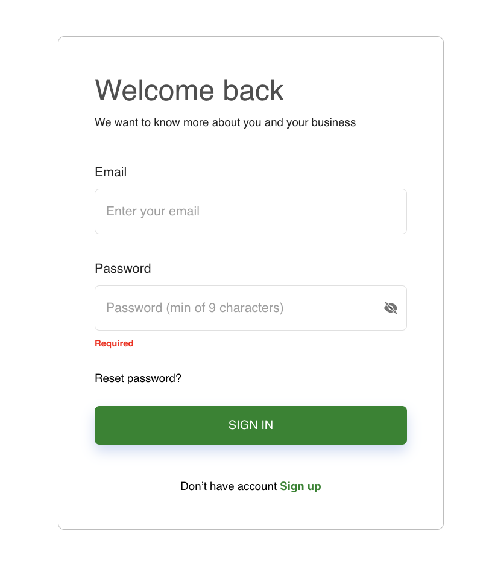
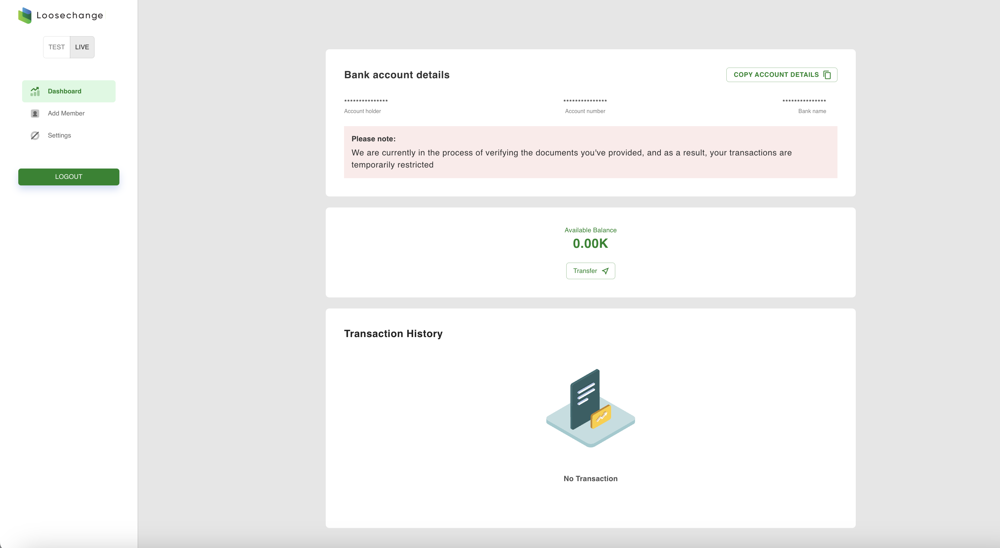
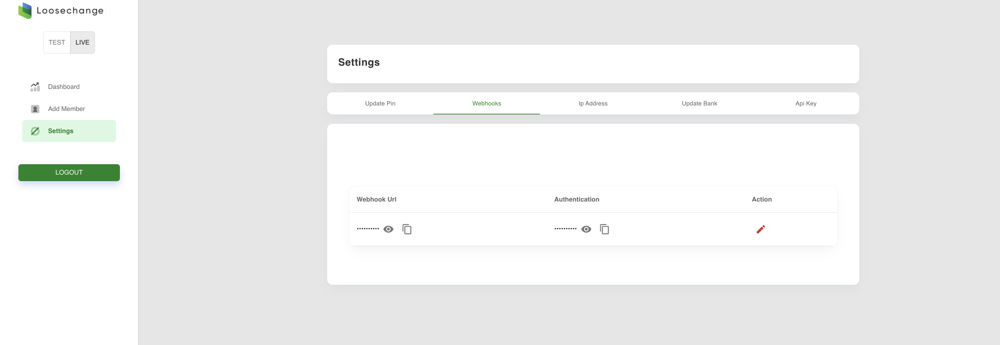

# Quickstart

> You can seamlessly be up and running with your Loosechange integration following the steps below

## Sign up 
sign up for an account if not done so yet. For testing purpsoses, [signup here] -> (https://sandbox.loosechange.app) 

<Frame width="auto" height="auto" >
  
</Frame>

## Login
Login using your email address

<Frame width="auto" height="auto" >
  
</Frame>

## Dashboard
You will land on your test dashboard.

<Frame width="auto" height="auto" >
  
</Frame>

## GET API keys
Locate your API keys by generating one in the settings tab.

<Frame width="auto" height="auto" >
  
</Frame>

## Webhook URL
Setup your webhook url in the settings tab. You will also be required to enter an authentication of your choice that will be used to push send notifications to your webhook.

<Frame width="auto" height="auto" >
  
</Frame>

## Ready
You are now ready to follow the rest of the documentation to integreate your choice of payments.

